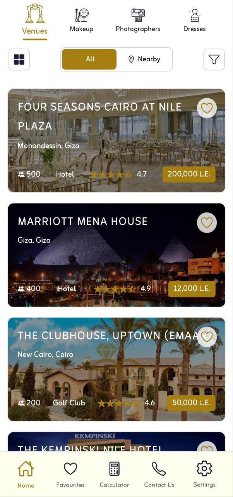
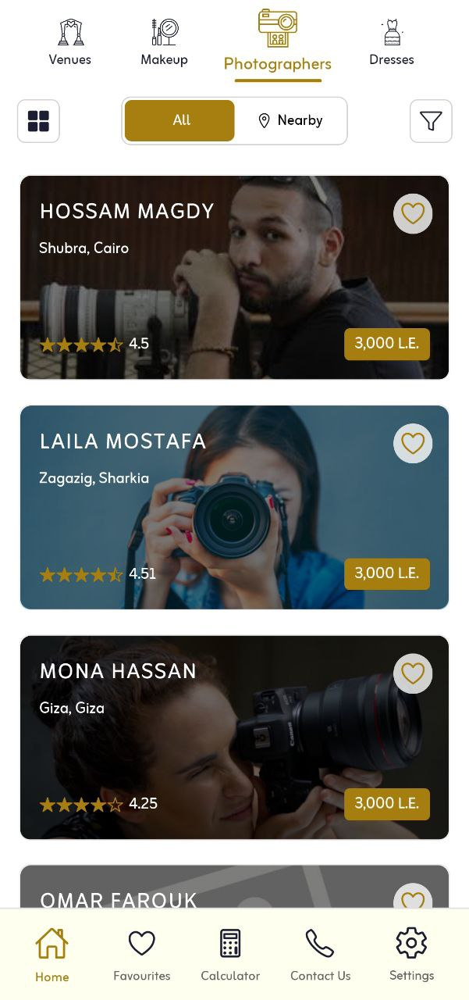
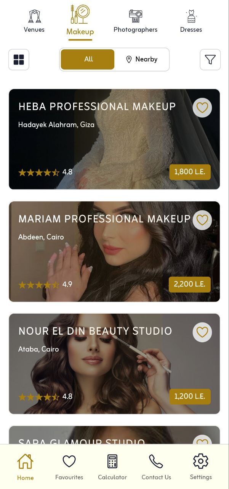
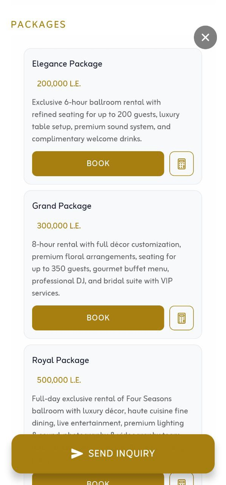
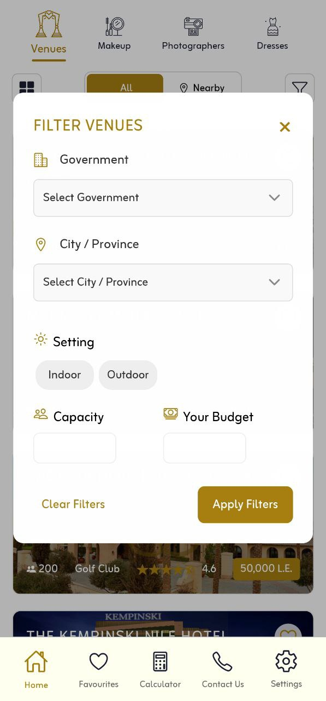
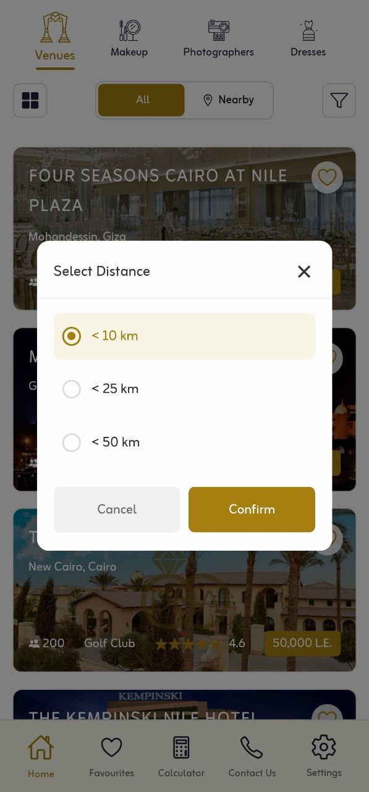

# 🎉 Dijamour Egypt — Wedding Discovery App (v2)

[](https://reactnative.dev/)
[](https://expo.dev/)
[](https://www.typescriptlang.org/)
[](https://supabase.com/)

> Modern, bilingual (Arabic/English with RTL) super app designed to be the ultimate destination for all wedding-related services in Egypt.

---

## 📸 Media Gallery

| Screenshot | Description |
|------------|-------------|
|  | **Landing Page** - Stylish Landing Page to choose the language |
|  |  |
|  | **Photographers** - Professional photography services |
|  | **Makeup Artists** - Beauty and styling services |
|  | **Venue Details** - Rich information with image carousel and packages |
|  | **Smart Filters** - Category-aware filtering system |
|  | **Nearby Discovery** - Location-based service finding |


---

## 🚀 Overview

Modern, bilingual (Arabic/English with RTL) super app designed to be the ultimate destination for all wedding-related services in Egypt. Starting with venues as the foundation, the platform now includes photographers and makeup artists, with plans to expand into catering, dresses, honeymoon packages, and wedding planners. It's architected as a comprehensive wedding ecosystem that provides smooth browsing, powerful filtering, near-me discovery, and rich details with contact shortcuts across all service categories.

---

## 🎯 App Scope & User Experience

### 📱 Core Categories
- **🏛️ Venues** (core foundation)
- **📸 Photographers** 
- **💄 Makeup Artists**
- **👗 Dresses** (coming soon)

### 🌐 Bilingual Experience
- **Arabic/English** with full RTL support
- **One-tap language switching**
- **Localized content and UI**

### 🏠 Home Screen Features
- **Top navigation bar** with logo and settings
- **Category selector** and unified controls bar
- **List/grid toggle** for flexible viewing
- **Near-me toggle** per category
- **Smart filters modal** (category-aware)

### 🔍 Browsing Experience
- **Responsive list/grid** via windowed FlatLists
- **Rich cards** showing image, name, location, rating, and pricing
- **Persistent favorites** with session storage
- **Smooth scrolling** and modern UI

### 📋 Details & Interaction
- **Image carousel** with zoom (performance-optimized)
- **Category-specific information** (pricing, amenities, packages)
- **Interactive maps** with "Directions" functionality
- **Quick contact actions**: WhatsApp, Call, Email, Social links

### 🎬 Landing Experience
- **First-run video intro** with background music
- **Two-button language choice** (Arabic/English)
- **Instant home access** on subsequent launches

---

## ⭐ Key Features

| Feature | Description |
|---------|-------------|
| 🗺️ **Near-me Discovery** | Location-based service finding for all categories |
| 🔧 **Smart Filtering** | Category-aware filters (cities, types, packages, budgets) |
| 🌍 **Bilingual Support** | Full Arabic/English with RTL-safe components |
| ❤️ **Favorites System** | Session-persistent saved items |
| 🖼️ **Rich Media** | Smooth image browsing with responsive UI |

---

## ⚡ Performance & Media Optimization

### 🎨 Media Handling
- **Windowed carousels** with lazy rendering
- **Memory-optimized zoom** (preload disabled)
- **Responsive image loading** for smooth performance

### 🚀 Performance Features
- **Short TTL response cache** (60s) for rapid toggles
- **Debounced persistence** to prevent write storms
- **Optimized networking** (timeouts + retries)

---

## 🌐 Networking & Reliability

### 🔄 Request Management
- **Consistent timeouts** and incremental backoff
- **Request de-duplication** to prevent duplicate calls
- **Short-lived response cache** (~60s)
- **Separate near-me caches** with expiry

### 🛡️ Error Handling
- **Friendly error messages** with context
- **Dedicated error screens** (app/network/venues)
- **Graceful degradation** strategies

---

## 💾 Caching Strategy

### 🧠 Client-Side Caching
- **In-memory TTL** for GET responses during filter changes
- **Nearest-results cache** keyed by location window
- **Location cache** (short-lived) to avoid repeated GPS calls
- **Persisted preferences**: favorites, layout mode

---

## 🌍 Localization & RTL Support

### 🔤 Language System
- **Centralized language context** (EN/AR)
- **RTL-aware primitives** (`RTLView`, `RTLText`)
- **Custom fonts** optimized for readability (Zain)

---

## 🔐 Security Architecture

### 🛡️ Security Measures
- **Public anon key** on client (safe by design)
- **Per-session JWT** for protected endpoints
- **Server-side verification** of all requests
- **Rate limiting** and input validation
- **No privileged keys** in client code

---

## ♿ Accessibility & Device Support

### 📱 Device Compatibility
- **Scales to small/medium screens**
- **Optimized text styles** for readability
- **Color choices** optimized against imagery

---

## 🗄️ Database Architecture

### 🏗️ Technical Foundation
- **PostgreSQL** with Supabase (managed)
- **Bilingual schema design** with language-specific prefixes (en_*, ar_*)
- **UUID primary keys** with proper indexing
- **Comprehensive constraints** and validation rules
- **Row Level Security (RLS)** policies for data protection
- **Automatic timestamp tracking** (created_at, modified_at)
- **Optimized queries** with strategic indexing
- **Extensible design pattern** for multiple service categories

---

## 🛠️ Technology Stack

| Layer | Technology |
|-------|------------|
| **📱 Mobile** | React Native, Expo Router, TypeScript |
| **☁️ Backend** | Supabase Edge Functions |
| **🔐 Authentication** | Anon key + per-session JWT |
| **📊 State Management** | Zustand with selectors |
| **💾 Storage** | AsyncStorage (preferences) |

---

## 🚀 Deployment & Build

### 📦 Build System
- **Expo Application Services (EAS)** for builds
- **Client keys** via Expo config strategy
- **No sensitive keys** in client code

---

## 🚀 Getting Started

### 📋 Prerequisites
- Node.js LTS
- Expo CLI
- iOS/Android simulator or device

### ⚡ Quick Start
```bash
# Install dependencies
npm install

# Start development server
npx expo start

# Run on device
# iOS: press 'i' | Android: press 'a'
```

> **Note**: Environment variables and keys should be configured through your Expo config. Never ship privileged keys.

---

## 🗺️ Development Roadmap

### 📅 Phase 2
- **🤖 Automated user inquiry system** via WhatsApp Business API with OTP phone validation
- **📊 Lightweight analytics** (privacy-preserving) for reliability insights
- **🔔 Push notifications** for new vendors, special offers, or nearby deals

### 📅 Phase 3
- **🏢 Vendor dashboard** for service providers to manage listings, track inquiries, and update availability
- **👥 User dashboard** for couples to save favorites, track inquiries, and manage wedding planning timeline
- **⭐ Native reviews and ratings system** to replace external Google Maps integration
- **📂 Service category expansion**: wedding dresses/suits, planners, catering, and honeymoon packages

### 📅 Phase 4
- **💳 Integrated payment processing** for direct booking and reservation management
- **🤖 AI-powered recommendation engine** to assist couples in selecting optimal venues and services based on budget and requirements

### 📅 Phase 5
- **🌍 International expansion**, beginning with Gulf Cooperation Council (GCC) markets

---

## 📞 Contact & Collaboration

| Platform | Link |
|----------|------|
| **📧 Email** | [amr.elsawalhi.business@gmail.com](mailto:amr.elsawalhi.business@gmail.com) |
| **💼 LinkedIn** | [amrelsawalhi](https://www.linkedin.com/in/amrelsawalhi/) |
| **🐙 GitHub** | [amrelsawalhi](https://github.com/amrelsawalhi) |

---

> **Note**: This v2 portfolio README summarizes the full product scope and engineering approach at a high level. It intentionally avoids business logic and database structure to maintain confidentiality while showcasing technical capabilities.


